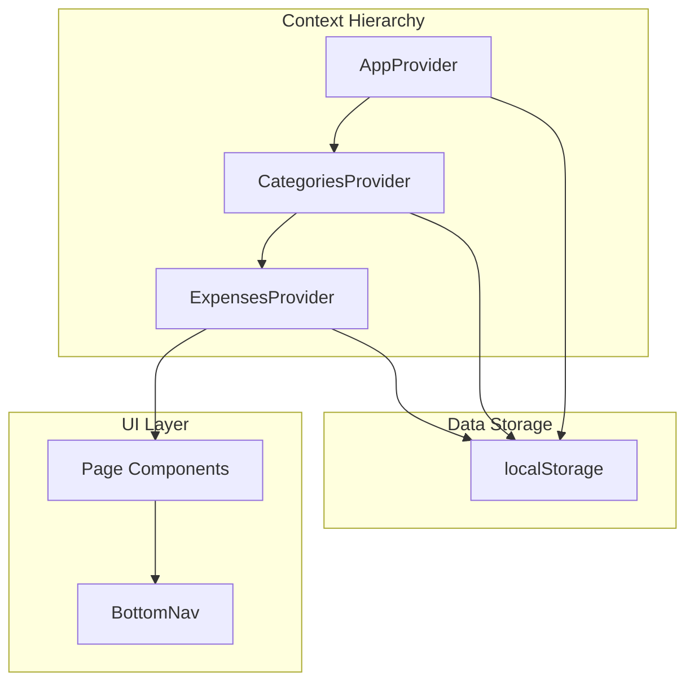

# Project Overview

<cite>
**Referenced Files in This Document**
- [package.json](file://package.json)
- [main.tsx](file://src/main.tsx)
- [AppContext.tsx](file://src/contexts/AppContext.tsx)
- [CategoriesContext.tsx](file://src/contexts/CategoriesContext.tsx)
- [ExpensesContext.tsx](file://src/contexts/ExpensesContext.tsx)
- [BottomNav.tsx](file://src/components/BottomNav.tsx)
- [page.tsx](file://src/pages/dashboard/page.tsx)
- [page.tsx](file://src/pages/expenses/page.tsx)
- [page.tsx](file://src/pages/add-expense/page.tsx)
- [config.tsx](file://src/router/config.tsx)
- [capacitor.config.ts](file://capacitor.config.ts)
- [tailwind.config.ts](file://tailwind.config.ts)
</cite>

## Table of Contents
1. [Introduction](#introduction)
2. [Project Structure](#project-structure)
3. [Core Components](#core-components)
4. [Architecture Overview](#architecture-overview)
5. [Detailed Component Analysis](#detailed-component-analysis)
6. [Dependency Analysis](#dependency-analysis)
7. [Performance Considerations](#performance-considerations)
8. [Troubleshooting Guide](#troubleshooting-guide)
9. [Conclusion](#conclusion)

## Introduction
The Expense Tracker is a comprehensive personal finance management application built with modern web technologies. It enables users to track expenses, manage categories, set budgets, and visualize spending patterns through an intuitive mobile-first interface. The application supports both web and Android platforms through Capacitor integration.

## Project Structure

```
expense-tracker/
├── android/              # Android platform files (Capacitor)
├── public/               # Static assets
├── src/
│   ├── assets/          # Images and static files
│   ├── components/      # Reusable UI components
│   │   └── BottomNav.tsx
│   ├── contexts/        # React Context providers
│   │   ├── AppContext.tsx
│   │   ├── CategoriesContext.tsx
│   │   └── ExpensesContext.tsx
│   ├── hooks/           # Custom React hooks
│   │   └── useCurrency.ts
│   ├── mocks/           # Mock data
│   │   └── expenses.ts
│   ├── pages/           # Page components
│   │   ├── dashboard/
│   │   ├── expenses/
│   │   ├── add-expense/
│   │   ├── categories/
│   │   ├── reports/
│   │   ├── settings/
│   │   └── profile/
│   ├── router/          # Routing configuration
│   │   ├── config.tsx
│   │   └── index.ts
│   ├── index.css        # Global styles
│   └── main.tsx         # Application entry
├── capacitor.config.ts  # Capacitor configuration
├── package.json         # Dependencies
├── tailwind.config.ts   # Tailwind CSS config
├── tsconfig.json        # TypeScript configuration
└── vite.config.ts       # Vite configuration
```

## Core Components

### Context Providers
The application uses three main context providers for state management:

1. **AppContext**: Manages global application settings
   - Currency selection and formatting
   - Dark mode toggle
   - User preferences persistence

2. **CategoriesContext**: Handles expense categories
   - CRUD operations for categories
   - Budget allocation per category
   - Category icons and colors

3. **ExpensesContext**: Manages expense records
   - Add and delete expenses
   - Filter by month/year
   - Calculate totals and statistics

### Navigation
- **BottomNav**: Fixed bottom navigation bar with five tabs
  - Dashboard
  - Expenses
  - Add Expense (floating action button)
  - Reports
  - Profile

### Page Components
- **Dashboard**: Financial overview with charts and summaries
- **Expenses**: List of all expenses with search/filter
- **Add Expense**: Form to create new expense entries
- **Categories**: Manage spending categories and budgets
- **Reports**: Visual analytics and spending trends
- **Settings**: App preferences and configuration
- **Profile**: User account information

## Architecture Overview

### Technology Stack
- **Frontend**: React 19.2.0 with TypeScript
- **Build Tool**: Vite 6.3.5
- **Styling**: Tailwind CSS 4.1.18
- **Routing**: React Router 7.13.0
- **Mobile**: Capacitor 7.0.0
- **Icons**: Remix Icons

### State Management Architecture



### Data Flow
1. Application boots from main.tsx
2. Context providers initialize from localStorage
3. Pages consume context data via hooks
4. User interactions update context state
5. Context persists changes to localStorage
6. UI automatically re-renders with new data

## Detailed Component Analysis

### AppContext
Manages global application state:
- Currency selection (USD, PHP, EUR, GBP, JPY, SGD, AUD, CAD)
- Dark mode toggle with CSS class management
- Amount formatting with currency symbols
- Persistence to localStorage

### CategoriesContext
Handles category management:
- Default categories with icons and colors
- Budget allocation per category
- CRUD operations (Create, Read, Update, Delete)
- localStorage persistence

### ExpensesContext
Manages expense tracking:
- Expense creation with unique IDs
- Expense deletion
- Monthly filtering
- Total calculations
- Statistics generation

### BottomNav
Navigation component:
- Fixed position at bottom
- Five navigation targets
- Active state highlighting
- Floating action button for quick add

## Dependency Analysis

### External Dependencies
| Package | Version | Purpose |
|---------|---------|---------|
| react | 19.2.0 | Core UI library |
| react-dom | 19.2.0 | DOM rendering |
| react-router-dom | 7.13.0 | Client-side routing |
| @capacitor/core | 7.0.0 | Mobile platform bridge |
| @capacitor/android | 7.0.0 | Android support |
| tailwindcss | 4.1.18 | Utility-first CSS |
| typescript | 5.8.3 | Type safety |
| vite | 6.3.5 | Build tool |

### Internal Dependencies
- Context providers have hierarchical dependencies
- Pages depend on contexts for data
- Components are largely independent
- Router coordinates page navigation

## Performance Considerations

### Optimization Strategies
1. **Lazy Loading**: Routes loaded on demand
2. **Context Optimization**: Selective re-renders
3. **Efficient Algorithms**: Linear-time data processing
4. **Storage Batching**: Minimized localStorage writes

### Mobile Optimization
- Touch-friendly interface
- Responsive design
- Smooth animations
- Efficient memory usage

## Troubleshooting Guide

### Common Issues

**Application won't start**
- Check Node.js version (18+)
- Verify all dependencies installed
- Check for port conflicts

**Data not persisting**
- Verify localStorage is enabled
- Check browser storage quota
- Validate JSON data format

**Android build issues**
- Ensure Android Studio is configured
- Check JDK installation
- Verify Capacitor sync

## Conclusion
The Expense Tracker demonstrates modern React development practices with:
- Clean architecture and separation of concerns
- Type-safe development with TypeScript
- Cross-platform deployment capability
- Efficient state management
- Mobile-first responsive design

For detailed information on specific components, refer to the individual documentation files in the respective folders.
